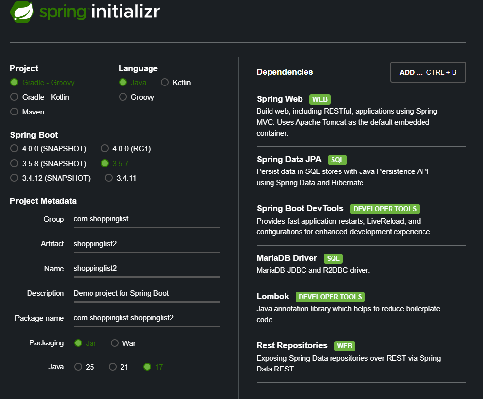

Spring boot 프로젝트 생성


1. build.gradle + application.properties 설정

- application.properties

```java
spring.datasource.url=jdbc:mariadb://localhost:3310/shoppinglist2db
spring.datasource.username=root
spring.datasource.password=1234
// MariaDB 데이터베이스와 연결할 때 사용할 JDBC 드라이버 클래스를 지정
spring.datasource.driver-class-name=org.mariadb.jdbc.Driver
```

2. Entity 및 Repository 생성

```java
// USER Entity
@Entity   // Entity 클래스라는 점을 명시
@Data     // Getter/setter 만들어줌
@NoArgsConstructor    // 기본 생성자 만들어줌
@AllArgsConstructor   // 전체 생성자 만들어 줌
@Table(name= "users") // db상에서 table 이름을 users로 지정함
public class User {
    @Id   // 기본키 지정
    @GeneratedValue(strategy = GenerationType.AUTO) // AutoIncrement
    @Column(nullable = false, updatable = false)
    // null 허용 X, updatable = false : 값이 한번 저장되면 수정 불가함.
    private Long id;

    @Column(nullable = false, updatable = true)
    private String username;

    @Column(nullable = false)
    @JsonIgnore // 비밀번호가 API 응답에 노출되지 않도록 함. 어차피 암호화 할 것이기 때문.
    private String password;

    @Column(nullable = false)
    private String role;

    // 한 명의 유저는 여러 개의 쇼핑 아이템을 가짐
    // mappedBy = "user" : ShoppingItem 테이블이 "user" 테이블과 연결되어있다는 뜻, ShoppingItem 테이블이 외래 키(FK: user_id)를 가짐
    // orphanRemoval = true: shoppingItem에 user가 없는 경우 삭제를 시킬 수 있음.
    // cascade = CascadeType.ALL : user가 삭제되면 참조하는 것들 다 삭제
    @OneToMany(mappedBy = "user", cascade = CascadeType.ALL, orphanRemoval = true)
    @JsonIgnore // car에서처럼 순환참조를 일으키지 않는다.
    private List<ShoppingItem> items;

    // CommandLineRunner 상에서 사용할 간단한 생성자 정의
    public User(String username, String password, String role) {
        this.username = username;
        this.password = password;
        this.role = role;
    }
}

// ShoppingItem 중 private User user;
// 여러 개의 아이템이 한 명의 유저에게 속함
@ManyToOne
@JoinColumn(name = "user_id")
@JsonIgnore
private User user;
```

- UserRepository / ShoppingItemRepository

```java
@RepositoryRestResource(exported = false)
public interface UserRepository extends JpaRepository<User, Long>  {

    // UserDetailsService에서 사용할 수 있는 추상 메서드
    Optional<User> findByUsername(String username);

}

//@RepositoryRestResource(exported = false)
// Spring Data REST에서 노출하지 않도록 함(외부에 들어나는가 -> false). 때문에 swagger-ui.html 에서 loginController 만 보임
public interface ShoppingItemRepository extends JpaRepository<ShoppingItem, Long> {
    // 사용자 정의 컨트롤러에서 사용
    List<ShoppingItem> findByUser(User user);

    // 삭제 / 수정 시 authentication 확인용
    Optional<ShoppingItem> findByIdAndUser(Long id, User user);
}
```

3. 로그인을 위한 Security

- JwtService / JwtAuthenticationFilter / AuthEntryPoint / SecurityConfig / UserDetailsServiceImpl 생성

- JwtService : JWT(Json Web Token) 을 생성하고 검증해서 사용자 인증을 처리하는 서비스 클래스

```java
@Component  // bean 등록을 하기 위해
public class JwtService {
  static final long EXPIRATION_TIME = 86400000;   // 토큰 만료 시간 1일
  static final String PREFIX = "Bearer ";         // 인증 헤더에 붙는 접두사

  // cardatabase 에서 deprecated로 떠서 SIG로 수정
  // 비밀키 생성
  private final SecretKey key = Jwts.SIG.HS256.key().build();

  // 사용자의 이름(username)을 기반으로 JWT를 생성
  public String generateToken(String username) {
      String jwt = Jwts.builder() // Jwts -> 새로운 JWT를 생성할 때 사용
              .subject(username)  // 사용자 이름 저장
              // 로그인 시점으로부터 1일 뒤 만료됨
              .expiration(new Date(System.currentTimeMillis() + EXPIRATION_TIME))
              .signWith(key)      // 비밀키로 서명
              .compact();         // 지금까지 지정한 정보를 모두 조합해서 JWT 문자열로 직렬화
      return jwt;
  }

  // 요청 헤더에서 JWT를 파싱하여(검증하여) 사용자 이름(subject) 추출
  public String getAuthUser(HttpServletRequest request) {
    // 요청 헤더에서 Authorization 값을 가져옴("Bearer ey...")
      String token = request.getHeader(HttpHeaders.AUTHORIZATION);

      if(token != null && token.startsWith(PREFIX)) {
          try {
            // JWT 문자열을 해석하기 위한 Parser 빌더를 만듦
            // parser : JWT의 서명 검증, 유효기간 확인, payload 추출 등을 담당
              String user = Jwts.parser()
                      .verifyWith(key)    // 비밀키를 검증
                      .build()            // 완성된 parser 객체
                      .parseSignedClaims(token.replace(PREFIX, ""))       // 접두사 "Bearer " 제거하고 내용을 가져옴
                      .getPayload()   // 내용을 꺼냄(header / payload / signature)
                      .getSubject();  // username을 꺼냄 위에 subject(username) 해뒀던거

              if(user != null) {
                  return user;
              }

          } catch (Exception e) {
              e.printStackTrace();
          }
      }
      return null;    // getAuthUser 메서드 호출했는데 user 안튀어나올 때 null return : 토큰이 없거나 유효하지 않음.
  }
}
```

- UserDetailsServiceImpl

```java
@Service
@RequiredArgsConstructor
public class UserDetailsServiceImpl implements UserDetailsService {

    private final UserRepository userRepository;

    @Override
    public UserDetails loadUserByUsername(String username) throws UsernameNotFoundException {
        Optional<User> user = userRepository.findByUsername(username);  // DB 조회

        // Builder를 통해 최종 UserDetails 객체를 만듦
        UserBuilder builder;
        if(user.isPresent()) {  // user 조회 결과 존재하면 currentUser에 user 엔티티 할당
            User currentUser = user.get();
            builder = withUsername(username); // static 메서드로 가져옴
            builder.password(currentUser.getPassword());
            builder.roles(currentUser.getRole());
        }else  {
            throw  new UsernameNotFoundException("사용자를 찾을 수 없습니다.");
        }

        return builder.build(); // UserDetails 객체를 생성해 반환함
    }
}
```

- JwtAuthenticationFilter : Spring Security에서 JWT를 이용한 인증 처리용 필터 클래스
  : 매 요청마다 JWT 토큰을 검사하고, 인증 정보를 SecurityContext에 등록하는 역할

```java
// JwtService와 UserDetaulsServiceImpl을 주입 받을겁니다.
@RequiredArgsConstructor
public class JwtAuthenticationFilter extends OncePerRequestFilter {

  private final JwtService jwtService;
  private final UserDetailsServiceImpl userDetailsService;

  @Override
  protected void doFilterInternal(HttpServletRequest request, HttpServletResponse response, FilterChain filterChain) throws ServletException, IOException {
      // header에서 사용자 이름(username)을 추출
      String username = jwtService.getAuthUser(request);

      // 사용자가 존재하고, Spring Security Context에 인증 정보가 없다면
      if(username != null && SecurityContextHolder.getContext().getAuthentication() == null) {
          // DB에서 user정보 조회
          UserDetails userDetails = userDetailsService.loadUserByUsername(username);

          // 토큰이 유효하면 인증 토큰을 생성하여 SecurityContext에 등록
          // 근데 잘 생각해보시면 getAuthUser()에서 검증이 끝났죠.
          // UsernamePasswordAuthenticationToken: 인증된 사용자 정보를 담는 객체.
          UsernamePasswordAuthenticationToken authentication =
                  new UsernamePasswordAuthenticationToken(userDetails, null, userDetails.getAuthorities());
          // (인증된 사용자 객체, 일반적으로 null, 권한 목록)
          // ( 위에서 인증된 user를 불러옴(userdetails) / 이미 jwt로 토큰이 검증되었기 때문에 비밀번호는 불필요함. 보안을 위해 null로 둠 / 이 사람의 권한을 불러옴)

          // 현재 요청의 IP주소, 세션 ID 같은 정보를 Authentication 객체에 추가해주는 코드
          authentication.setDetails(new WebAuthenticationDetailsSource().buildDetails(request));

          // 현재 요청을 이 사용자가 인증된 상태로 만듦, 인증 객체를 등록해줌
          SecurityContextHolder.getContext().setAuthentication(authentication);
      }

      // 필터로 요청을 넘김. 이후의 필터나 컨트롤러에서는 인증된 사용자에 접근 가능
      filterChain.doFilter(request, response);
  }
}
```

- AuthEntryPoint : 인증되지 않은 사용자가 보호된(secured) 리소스에 접근할 때 Spring Security가 자동으로 호출하는 예외 처리 핸들러

```java
@Component
public class AuthEntryPoint implements AuthenticationEntryPoint {
    // 인증되지 않은 사용자가 보호된 리소스에 접근하려 할 때 호출됨. 로그인할 때 404로 뜨는걸 401로 바꿔주기 위한 역할
    @Override
    public void commence(HttpServletRequest request, HttpServletResponse response, AuthenticationException authException) throws IOException, ServletException {
        // 401 응답하기 위해서 커스텀
        response.setStatus(HttpServletResponse.SC_UNAUTHORIZED);
        response.setContentType("application/json");
        response.getWriter().write("{\"error\": \"Unauthorized - Please Log In\"}");
    }
}
```

- SecurityConfig : JWT 기반 인증을 사용하는 Spring Boot 애플리케이션의 보안 중심부

```java
// security에 필요한 두 어노테이션
@Configuration
@EnableWebSecurity
@RequiredArgsConstructor
public class SecurityConfig {

    private final UserDetailsServiceImpl userDetailsService;
    private final JwtService jwtService;
    private final AuthEntryPoint authEntryPoint;

    // 비밀번호 암호화기 Bean 등록, 비밀번호를 암호화/비교할 때 사용
    // Spring Security는 로그인 시 비밀번호 비교를 할 때 이 PasswordEncoder를 자동으로 사용
    @Bean
    public PasswordEncoder passwordEncoder() {
        return new BCryptPasswordEncoder();
    }

    // Spring Security의 인증을 실제로 수행하는 객체
    // 로그인 요청 시 아이디/비밀번호를 받아 인증 여부를 결정할 때 사용
    @Bean
    public AuthenticationManager authenticationManager(AuthenticationConfiguration config) throws Exception {
        return config.getAuthenticationManager();
    }

    // 우리가 만든 JwtAuthenticationFilter(JWT 인증 필터)를 직접 Bean으로 등록
    // 매 요청마다 JWT를 검증해서 인증 정보를 SecurityContext에 넣어주는 역할
    @Bean
    public JwtAuthenticationFilter authenticationFilter() {
        return new JwtAuthenticationFilter(jwtService, userDetailsService);
    }

    // 애플리케이션의 보안 정책(인증/인가/세션/CORS 등) 을 전부 설정
    @Bean
    public SecurityFilterChain filterChain(HttpSecurity http) throws Exception {
//        http.csrf(AbstractHttpConfigurer::disable)  // CSRF 보호 비활성화(Stateless JWT 사용)
//                .cors(Customizer.withDefaults())    // CORS 설정(이하의 설정 사용) 어떤 로컬호스트를 기준으로 할것인가 설정
//                .sessionManagement(session -> session.sessionCreationPolicy(SessionCreationPolicy.STATELESS))   // 세션 대신 JWT를 사용하므로 세션 비활성화
//                .authorizeHttpRequests(auth -> auth
//                        // login 엔드포인트의 POST 요청은 모두 허용
//                        .requestMatchers(HttpMethod.POST, "/login").permitAll()
//                        .requestMatchers("/swagger-ui/**", "/api-docs/**").permitAll()
//                        .anyRequest().authenticated())
//                .exceptionHandling(ex -> ex.authenticationEntryPoint(authEntryPoint))   // 인증 실패 시 처리
//                .addFilterBefore(authenticationFilter(), UsernamePasswordAuthenticationFilter.class);   // JWT 필터 추가

//         개발 중 로그인 포함 모든 HTTP 메서드 요청 허용
        http.csrf(csrf -> csrf.disable())
                .cors(withDefaults())
                .authorizeHttpRequests(authorizeHttpRequests ->
                        authorizeHttpRequests.anyRequest().permitAll());
        return http.build();
    }

    @Bean
    public CorsConfigurationSource corsConfigurationSource() {
        CorsConfiguration configuration = new CorsConfiguration();
        // 허용할 프론트 엔드 주소
        configuration.setAllowedOrigins(Arrays.asList("http://localhost:5173", "http://localhost:5174"));
        // 허용할 메서드
        configuration.setAllowedMethods(Arrays.asList("GET", "POST", "PULL", "DELETE", "PATCH"));
        // 허용할 헤더
        configuration.setAllowedHeaders(Arrays.asList("*"));    // 모든 헤더 허용
        // 쿠키나 인증 정보 허용
        configuration.setAllowCredentials(true);
        UrlBasedCorsConfigurationSource source = new UrlBasedCorsConfigurationSource();
        // 모든 경로에 대해 CORS 정책 허용
        source.registerCorsConfiguration("/**", configuration);
        return source;
    }

}
```

- loginController

```java
@RestController
@RequiredArgsConstructor
public class LoginController {

    private final JwtService jwtService;
    private final AuthenticationManager authenticationManager;

    @PostMapping("/login")
    public ResponseEntity<?> login(@RequestBody AccountCredentials credentials) {
        // 자격 증명으로 인증 토큰 생성하는 과정
        UsernamePasswordAuthenticationToken creds = new UsernamePasswordAuthenticationToken(credentials.username(), credentials.password());

        // 사용자 인증
        Authentication auth = authenticationManager.authenticate(creds);

        // JWT 생성
        String jwt = jwtService.generateToken(auth.getName());

        // JWT를 'Authorization' 헤더에 담아서 응답
        return ResponseEntity.ok()
                .header(HttpHeaders.AUTHORIZATION, "Bearer ", jwt)
                .header(HttpHeaders.ACCESS_CONTROL_EXPOSE_HEADERS, "Authorization") // FrontEnd에서 헤더를 읽을 수 있도록 설정
                .build();
    }
}
```

http://localhost:8080/swagger-ui.html
